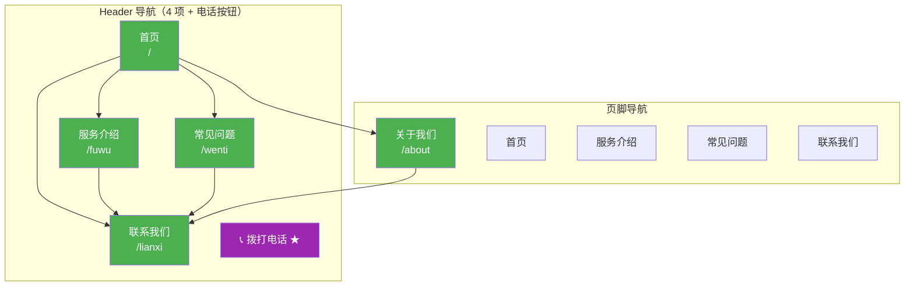

# 网站栏目、导航与内容层级方案

> 场景：同一产品改为面向 **50 岁以上首次使用智能手机** 的用户；发布窗口 **14 天**；预算 **8,000 元**；主要触点从桌面网页改为 **线下社区与微信**。

---

## 一、约束变化如何改变原方案

| 约束维度 | 原方案（桌面网页为主） | 本方案（线下+微信、老年首用智能机） | 对信息架构的影响 |
|---|---|---|---|
| **目标用户** | 通用互联网用户，熟悉网页操作 | 50 岁以上、首次使用智能手机，数字素养低，视力/操作精度下降 | 导航项压到最少；不用下拉/悬浮/汉堡菜单；字号大、按钮大；每页只放一个主行动；避免专业术语和英文导航词 |
| **发布窗口** | 常规周期（通常 4–8 周） | 14 天 | 只做 MVP 页面（5–6 个）；不做定制开发；用现成模板/低代码搭建；砍掉博客、案例、文档、对比页等可延后内容 |
| **预算** | 常规建站预算 | 8,000 元 | 不做定制设计与多端适配；用模板站（如凡科/微盟/建站之星等）一次性付费；不做 SEO 程序页、不做积分/会员系统 |
| **主要触点** | 桌面网页直接访问 | 线下社区（宣传单、海报、工作人员口述）+ 微信（公众号文章/群链接/小程序） | 网站不是流量入口，而是**信任背书与信息备查页**；导航要支持"从微信点开就能看懂、能拨通电话"；URL 不需要短链营销，但要能在微信内正常打开；首页必须**首屏可见电话和微信二维码** |
| **站点类型定位** | 可能是 SaaS/内容/电商等多层结构 | 小型本地服务/社区类站点（对应 Skill 中 "Small business / local" 类型） | 采用**扁平 1–2 层结构**；所有页面从首页 1 次点击可达；不设 L3 以下深层页面 |

**核心判断**：本方案不是把原方案"缩小"，而是**把网站从"主转化阵地"降级为"线下与微信触点的信息落地页"**。信息架构的首要目标不是 SEO 或内容丰富度，而是**让老人能看懂、敢点击、能拨通电话/加上微信**。

---

## 二、目标

1. **可理解**：首次用智能手机的老人能在 30 秒内明白"这个网站是干什么的"。
2. **可操作**：从任意页面 1 次点击即可拨打联系电话或看到微信二维码。
3. **可交付**：14 天内、8,000 元内上线，使用现成模板，不写定制代码。
4. **可延展**：结构预留后续加页空间（如活动通知、用户故事），但本期不做。

---

## 三、依据

- **Skill 站点类型表**："Small business / local" 类型建议 1–2 层、扁平结构、Header 4–6 项 + CTA，本方案据此选型。
- **3 次点击原则**：Skill 要求重要页面 3 次点击内可达；本方案进一步收紧为**所有页面 1 次点击可达**（因目标用户操作能力弱）。
- **Header 导航规则**：Skill 建议 4–7 项；本方案取**下限 4 项**，且不使用下拉菜单（避免老人误操作和悬浮交互障碍）。
- **URL 设计原则**：人类可读、小写、连字符、反映层级、简短；本方案全部使用 1 层路径（`/fuwu`、`/lianxi` 等），无嵌套。
- **面包屑规则**：Skill 要求面包屑与 URL 层级一致；本方案因全站仅 1 层深度，**不使用面包屑**（无层级可显示，反而增加困惑）。
- **内部链接规则**：无孤儿页、描述性锚文本、重要页面多链入；本方案每页都在 Header/页脚有入口，首页链向所有子页。

---

## 四、页面层级（ASCII Tree）

```
首页 (/)
├── 服务介绍 (/fuwu)
├── 常见问题 (/wenti)
├── 关于我们 (/about)
└── 联系我们 (/lianxi)
```

**说明**：
- 全站共 **5 个页面**，全部为 L0–L1，无 L2 及更深页面。
- "关于我们"在 Header 中不出现（见导航规格），仅从首页和页脚可达，减少首屏导航负担。
- 不设博客、案例、文档、定价、对比、集成等页面——这些在原桌面方案中可能存在，但本期因时间/预算/用户画像全部砍掉。

---

## 五、可视化站点地图（Mermaid）



图例：绿色 = 本期上线页面；紫色 = 全站常驻 CTA 按钮（非独立页面，点击直接拨号）。

---

## 六、URL 映射表

| 页面 | URL | 父页面 | 导航位置 | 优先级 | 备注 |
|---|---|---|---|---|---|
| 首页 | `/` | — | Header（Logo + 首页） | 关键 | 首屏必须有电话按钮和微信二维码 |
| 服务介绍 | `/fuwu` | 首页 | Header | 高 | 用简短中文服务描述，配大图，不用专业术语 |
| 常见问题 | `/wenti` | 首页 | Header | 高 | 问答形式，字号大，每条可展开/收起但默认展开前 3 条 |
| 联系我们 | `/lianxi` | 首页 | Header（CTA 样式） | 关键 | 电话可点击拨号、微信二维码大图、线下地址+地图截图、公交/地铁路线文字 |
| 关于我们 | `/about` | 首页 | 页脚 | 中 | 团队/机构照片、资质、服务宗旨，建立信任感 |

**URL 设计说明**：
- 全部使用**拼音 slug**（而非英文），因为：(1) 目标用户为中国老年人，拼音在微信转发/书签中比英文更易辨认；(2) 与 Skill "人类可读"原则一致。
- 全部小写、无下划线、无日期、无查询参数、无 ID。
- 无嵌套层级，不需要重定向规则（新站，无旧 URL 需保留）。

---

## 七、导航规格

### 7.1 Header 导航（全站统一，4 项 + CTA）

```
[Logo/站名]    首页    服务介绍    常见问题     [📞 拨打电话]
```

规则：
- **4 个导航项 + 1 个电话按钮**，不使用下拉菜单、不使用汉堡菜单（老人不知道汉堡图标含义）。
- 电话按钮为**填充色实心按钮**，右侧固定，在所有页面常驻可见。
- Logo 点击回首页。
- 当前页项用**加粗 + 下划线**标记，不用浅色/微小指示器。
- 导航项文字**不使用英文**，不用"产品""解决方案""资源"等泛词，直接用"服务介绍""常见问题"。
- 字号建议：导航文字 **≥ 20px**（桌面）/ **≥ 18px**（手机）；按钮高度 **≥ 48px**，符合触屏可点击区域规范。

### 7.2 页脚导航

```
┌─────────────────────────────────────────────┐
│  [Logo/站名]                                 │
│                                              │
│  快速入口          联系方式                   │
│  ────────          ────────                  │
│  首页              电话：010-XXXXXXXX        │
│  服务介绍          微信：[二维码图片]          │
│  常见问题          地址：XX市XX区XX路XX号     │
│  关于我们                                     │
│  联系我们                                     │
│                                              │
│  © 2026 机构名称    隐私声明    使用帮助       │
└─────────────────────────────────────────────┘
```

- 不做 4 列复杂页脚（Skill 标准列模式对老人过于密集），改为**2 列极简布局**。
- 页脚同样放微信二维码，方便老人滚动到底部时扫码。
- 法律页（隐私声明）本期可合并为单页 `/yinsi`，内容用通俗中文，不用法律术语堆砌。

### 7.3 面包屑

**不使用面包屑**。理由：全站仅 1 层深度，面包屑无意义；额外的导航元素会增加老人认知负担。这是对 Skill "面包屑应反映 URL 层级"规则的**有意取舍**——当层级深度为 1 时，面包屑退化为"首页 > 当前页"，信息增量为零。

### 7.4 移动端导航

- 网站主要在**微信内置浏览器**中打开（手机端），Header 同上，不折叠为汉堡菜单。
- 电话按钮在手机端点击直接触发拨号（`tel:` 链接）。
- 不做底部 Tab 栏（那是 App 模式，网站不需要）。

---

## 八、内部链接计划

### 8.1 链接结构

本站页面极少，内部链接策略极简：

| 来源页面 | 链向页面 | 链接形式 |
|---|---|---|
| 首页 | 服务介绍、常见问题、关于我们、联系我们 | Header 导航 + 首页正文大按钮 |
| 服务介绍 | 联系我们 | 正文末尾"想了解更多？请联系我们" + 页脚 |
| 常见问题 | 联系我们 | 每条相关问题末尾"还有疑问？打电话" + 页脚 |
| 关于我们 | 联系我们 | 正文末尾 + 页脚 |
| 所有页面 | 首页、服务介绍、常见问题、联系我们、关于我们 | Header/页脚常驻 |

### 8.2 内部链接检查清单

- [x] 每个页面至少有 1 个入站内部链接（全部页面在 Header/页脚有入口）
- [x] 无 404 断链（新站，页面少，上线前逐页点击验证）
- [x] 锚文字描述性（"联系我们""服务介绍"，不用"点击这里""了解更多"孤立使用）
- [x] 最重要页面（联系我们）入站链接最多（每个子页都有）
- [x] 无孤儿页
- [ ] 面包屑——**本期不实施**（见 7.3 取舍说明）
- [ ] 相关内容推荐——本期不实施（页面太少，无内容可推荐）

---

## 九、执行步骤、优先级与取舍

### 9.1 14 天执行排期

| 阶段 | 天数 | 事项 | 负责人/角色 |
|---|---|---|---|
| **第 1–2 天** | D1–D2 | 确认 5 个页面文案初稿；选定建站模板（支持微信内打开、`tel:` 拨号、大字号主题）；购买域名（如需）并完成备案/免备案选型 | 产品 + 运营 |
| **第 3–5 天** | D3–D5 | 填充首页、服务介绍、联系我们 3 个**关键页面**内容；准备电话、微信二维码、地址、机构照片等素材 | 内容 + 设计 |
| **第 6–8 天** | D6–D8 | 填充常见问题、关于我们；在模板中配置 Header/页脚；测试微信内打开效果 | 内容 + 技术 |
| **第 9–10 天** | D9–D9 | **老年用户可用性测试**：找 3–5 位目标用户（50 岁以上、首次用智能机），观察能否完成"看懂网站→找到电话→拨通"流程，记录卡点 | 产品 + 运营 |
| **第 11–12 天** | D11–D12 | 根据测试修改文案/字号/按钮位置；上线 | 技术 |
| **第 13–14 天** | D13–D14 | 微信公众号菜单/群/线下物料印上网站二维码；工作人员熟悉网站内容以便口述引导 | 运营 |

### 9.2 优先级

| 优先级 | 页面/功能 | 理由 |
|---|---|---|
| **P0（必须有）** | 首页、服务介绍、联系我们、Header 电话按钮、微信二维码 | 直接支撑"看懂→联系"核心路径 |
| **P1（应有）** | 常见问题、关于我们 | 减少重复电话咨询、建立信任 |
| **P2（可延后）** | 活动通知页、用户故事/评价、在线留言表单、隐私声明详细页 | 本期不做，后续按需追加 |
| **P3（本期不做）** | 博客/资讯、案例、搜索框、会员注册、在线支付、多语言 | 与目标用户和预算/时间不匹配 |

### 9.3 关键取舍

| 取舍 | 选择 | 放弃 | 理由 |
|---|---|---|---|
| 导航深度 | 1 层扁平，5 页面 | 多层下拉、内容分区 | 老人操作能力弱，3 次点击原则收紧为 1 次 |
| 交互方式 | 纯点击大按钮、`tel:` 拨号 | 悬浮、下拉、汉堡、动画 | 老人不熟悉隐藏交互，触屏精度低 |
| 内容策略 | 5 页静态信息 | 博客、SEO 内容、程序化页面 | 主触点是线下+微信，网站不承担拉新 |
| 技术方案 | 模板/低代码建站 | 定制开发、响应式手写 | 8,000 元 + 14 天不支持定制 |
| 面包屑 | 不实施 | 全站面包屑 | 单层深度无意义，增加认知负担 |
| 页脚 | 2 列极简 | 4 列标准页脚 | 信息密度过高反而干扰老人 |
| CTA | 拨打电话（主） + 微信二维码（辅） | 在线注册、表单提交、购买 | 老人更信任电话/微信沟通，不愿在线填表 |

---

## 十、风险

| 风险 | 影响 | 缓解措施 |
|---|---|---|
| **模板不支持微信内拨号或二维码展示异常** | 核心转化路径断裂 | D1–D2 选型时即用微信真机测试模板演示站；备选 2 个模板 |
| **老年用户测试找不到足够受试者** | 可用性问题上线后才暴露 | D1 即联系社区工作人员预约 3–5 位老人；若不足，由工作人员模拟老年操作（戴老花镜、单指操作） |
| **文案仍含专业术语** | 老人看不懂 | 文案写完后让非互联网行业的中年人朗读一遍，听不懂的词全部替换；常见问题用"我想……"句式而非功能名词 |
| **域名备案耗时超过 14 天** | 网站无法用自有域名访问 | 优先使用免备案服务器/建站平台自带二级域名；自有域名备案并行进行，上线后再切换 |
| **微信二维码过期或个人号加人受限** | 用户无法加微信 | 使用企业微信活码（永不过期、可多人接待）；页脚同时保留电话兜底 |
| **线下物料印错网址/二维码** | 流量流失 | D13 印刷前由 2 人分别扫码验证；网址用短链接或平台自带域名减少输入错误 |
| **8,000 元预算覆盖不了模板年费+素材** | 超支 | 选模板时确认年费 ≤ 3,000 元；素材用真实照片而非付费图库；预留 1,000 元应急 |

---

## 十一、衡量方式

本期不设复杂数据指标，用**可观察的行为指标**判断网站是否有效：

| 指标 | 衡量方式 | 目标（上线后 30 天内） |
|---|---|---|
| 电话拨打量 | 对比网站上线前后同一电话的来电总量 | 月来电数较上线前增长（具体基线需上线前先统计 1 周） |
| 微信加好友量 | 企业微信后台统计通过网站二维码添加的人数 | 每周 ≥ 5 人通过网站二维码添加（基线为 0） |
| 老人可用性 | 上线前可用性测试中，5 位老人独立完成"找到电话并拨通"的比例 | ≥ 4/5 成功 |
| 页面可达性 | 逐页点击验证：所有导航链接、电话按钮、二维码在微信内正常工作 | 100% 页面无死链、无错位 |
| 内容理解 | 常见问题页面覆盖了实际来电中重复出现的问题 | 上线后每周更新 1–2 条新 FAQ，1 个月后 FAQ 覆盖 ≥ 80% 重复咨询 |

**不衡量**：SEO 排名、自然搜索流量、PV/UV 深度、转化率——因为网站不是流量入口，这些指标与本期目标无关。

---

## 十二、下一步

1. **立即（D1）**：确认产品/服务的中文标准名称和一句话介绍（用于首页首屏）；确认联系电话、微信二维码、线下地址；选定建站模板并完成微信真机测试。
2. **D2–D3**：完成首页 + 联系我们页面文案，这两个页面决定核心路径，优先于其他。
3. **D8 前**：联系社区落实 3–5 位老年测试用户。
4. **上线后**：每周查看来电/加微信数据，每月更新一次常见问题；根据实际咨询量决定是否追加"活动通知"或"用户评价"页面。
5. **后续迭代（本期不做，记录备查）**：若线下+微信模式跑通、预算追加，可考虑 (a) 接入微信小程序替代网站、(b) 增加在线预约表单、(c) 增加活动报名页——但这些均不在本期 14 天/8,000 元范围内。

---

## 十三、自检清单（对照 SKILL.md 输出要求）

| SKILL.md 要求 | 本方案是否满足 | 说明 |
|---|---|---|
| 1. Page Hierarchy (ASCII Tree) | ✅ | 见第四节 |
| 2. Visual Sitemap (Mermaid) | ✅ | 见第五节，使用 `graph TD` 并标注导航区域 |
| 3. URL Map Table | ✅ | 见第六节，含页面/URL/父页面/导航位置/优先级 |
| 4. Navigation Spec | ✅ | 见第七节，含 Header、页脚、面包屑说明、移动端 |
| 5. Internal Linking Plan | ✅ | 见第八节，含链接结构和检查清单 |
| 3 次点击原则 | ✅ 超额满足 | 所有页面 1 次点击可达 |
| Header 4–7 项 | ✅ | 4 项 + CTA，取下限 |
| URL 可读/小写/连字符/简短 | ✅ | 全部 1 层拼音 slug |
| 无孤儿页 | ✅ | 每页都在 Header/页脚有入口 |
| 描述性锚文本 | ✅ | 用"服务介绍""联系我们"等明确文字 |
| 面包屑与 URL 一致 | ⚠️ 有意取舍 | 单层深度不实施面包屑，已在 7.3 说明理由 |
| 不编造数据/来源/已完成动作 | ✅ | 所有数字为约束条件内推算，未虚构用户数据、未声称已上线/已测试 |
| 覆盖目标/依据/步骤/取舍/风险/衡量/下一步 | ✅ | 见第二、三、九、十、十一、十二节 |

---

## 十四、实际读取的 Skill 文件及影响

| 文件路径 | 读取情况 | 对本方案的影响 |
|---|---|---|
| `SKILL.md` | ✅ 完整读取 | 定义了全部输出格式（ASCII Tree、Mermaid、URL Map、Nav Spec、Internal Linking）；提供了站点类型选型表（选 Small business/local）；规定了 3 次点击原则、Header 4–7 项、URL 设计 6 原则、内部链接检查清单——这些直接决定了本方案的结构和自检项 |
| `references/site-type-templates.md` | ✅ 完整读取 | Small business 模板的扁平 1–2 层结构、Services/About/Contact 页面划分、Header 5 项 + CTA 模式，是本方案页面规划的直接起点；本方案在此基础上进一步精简为 4 项导航 + 电话 CTA |
| `references/navigation-patterns.md` | ✅ 完整读取 | Header 简单导航规则（Logo 左、CTA 右、当前页指示器）、页脚分栏模式、移动端不依赖汉堡菜单的反模式提醒、"mystery icons"反模式——直接影响了导航规格中"不用汉堡菜单、不用纯图标按钮"的决定 |
| `references/mermaid-templates.md` | ✅ 完整读取 | 提供了 `graph TD` 语法、subgraph 标注导航区域的写法、颜色编码约定（绿=已有、蓝=新增、紫=高优 CTA）——本方案第五节 Mermaid 图直接复用了这些模式 |
| `evals/evals.json` | ✅ 完整读取 | 6 个测试用例帮助确认 Skill 对"完整交付物""3 次点击""导航精简""URL 规范"的期望标准；本方案自检清单（第十三节）逐条对照了这些断言 |

**未读取/不存在的文件**：
- `.agents/product-marketing.md` / `.claude/product-marketing.md` / `product-marketing-context.md`：SKILL.md 要求优先检查这些文件，已确认工作目录中均不存在，因此本方案基于用户消息中提供的事实直接规划，未假设额外的产品营销上下文。
