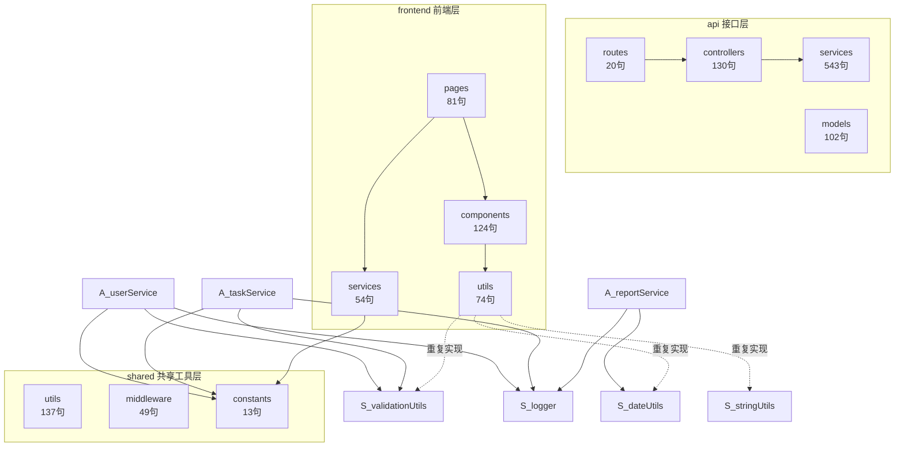

# 组件识别与度量分析报告

> 由 `scripts/analyze-components.js` 自动生成，遵循 component-identification-sizing Skill 规则
> 分析根目录：`/Users/bytedance/Doubao/chats/2026-08-12/new-chat-410/task-manager-app`

## 一、规模统计摘要

- **组件总数（叶子节点）**：11
- **总语句数**：1,327
- **平均组件大小**：121 语句
- **标准差**：146 语句
- **应用规模判定**：中型（10-20），超大阈值 15%

- **超大组件**：1 个
- **过小组件**：1 个
- **大小正常**：9 个

## 二、组件清单表

| 组件 | 路径 | 层 | 语句数 | 文件数 | 占比 | 标准差倍数 | 状态 |
| --- | --- | --- | ---: | ---: | ---: | ---: | --- |
| services | `api/services` | 接口层 | 543 | 5 | 40.9% | +2.89σ | ⚠️ 过大 |
| utils | `shared/utils` | 共享工具层 | 137 | 4 | 10.3% | +0.11σ | ✅ 正常 |
| controllers | `api/controllers` | 接口层 | 130 | 4 | 9.8% | +0.06σ | ✅ 正常 |
| components | `frontend/components` | 前端层 | 124 | 6 | 9.3% | +0.02σ | ✅ 正常 |
| models | `api/models` | 接口层 | 102 | 3 | 7.7% | -0.13σ | ✅ 正常 |
| pages | `frontend/pages` | 前端层 | 81 | 3 | 6.1% | -0.27σ | ✅ 正常 |
| utils | `frontend/utils` | 前端层 | 74 | 2 | 5.6% | -0.32σ | ✅ 正常 |
| services | `frontend/services` | 前端层 | 54 | 2 | 4.1% | -0.46σ | ✅ 正常 |
| middleware | `shared/middleware` | 共享工具层 | 49 | 2 | 3.7% | -0.49σ | ✅ 正常 |
| routes | `api/routes` | 接口层 | 20 | 4 | 1.5% | -0.69σ | ✅ 正常 |
| constants | `shared/constants` | 共享工具层 | 13 | 1 | 1.0% | -0.74σ | 🔍 过小 |

## 三、组件大小分布

services             ████████████████████████████████████████ 40.9%
utils                ██████████ 10.3%
controllers          ██████████ 9.8%
components           █████████ 9.3%
models               ████████ 7.7%
pages                ██████ 6.1%
utils                █████ 5.6%
services             ████ 4.1%
middleware           ████ 3.7%
routes               █ 1.5%

## 四、超大组件功能区分析

### services（40.9%，543 语句）

路径：`api/services`

该组件内各文件语句数：

- `userService.js`：276 语句
- `reportService.js`：110 语句
- `taskService.js`：71 语句
- `projectService.js`：50 语句
- `notificationService.js`：36 语句

## 五、跨层重复逻辑证据

| 重复函数 | 文件 A | 文件 B | 相似度 |
| --- | --- | --- | ---: |
| `formatDate` | `shared/utils/dateUtils.js` | `frontend/utils/formatters.js` | 100% |
| `formatDateTime` | `shared/utils/dateUtils.js` | `frontend/utils/formatters.js` | 75% |
| `capitalize` | `shared/utils/stringUtils.js` | `frontend/utils/formatters.js` | 100% |
| `truncate` | `shared/utils/stringUtils.js` | `frontend/utils/formatters.js` | 100% |
| `isEmail` | `shared/utils/validationUtils.js` | `frontend/utils/validators.js` | 100% |
| `isNotEmpty` | `shared/utils/validationUtils.js` | `frontend/utils/validators.js` | 100% |
| `minLength` | `shared/utils/validationUtils.js` | `frontend/utils/validators.js` | 100% |
| `maxLength` | `shared/utils/validationUtils.js` | `frontend/utils/validators.js` | 100% |
| `isPositiveInteger` | `shared/utils/validationUtils.js` | `frontend/utils/validators.js` | 100% |
| `countByStatus` | `frontend/components/ProjectBoard.js` | `api/models/Task.js` | 72% |

## 六、组件边界图（Mermaid）



## 七、改造优先级

按 Skill 建议分三级：高优先级拆分超大组件与消除重复，中优先级审查过小组件，低优先级监控正常组件。

### P0 高优先级

1. **拆分 `api/services`（543 语句，占 40.9%，+2.89σ）**
   - 该组件为叶子目录但混合了多个独立职责，违反单一职责；按 Skill "Gather Common Domain Components → Flatten Components → Create Component Domains" 流程，按功能区拆为子目录组件。
   - `userService.js`（276 语句）为主要膨胀源，应优先按内部功能区拆分。
   - `reportService.js`（110 语句）为主要膨胀源，应优先按内部功能区拆分。
2. **消除跨层重复：`shared/utils/dateUtils.js ↔ frontend/utils/formatters.js`**
   - 重复函数：`formatDate`、`formatDateTime`
   - 做法：前端直接引用 shared 层实现，删除前端副本；仅保留前端特有函数。
3. **消除跨层重复：`shared/utils/stringUtils.js ↔ frontend/utils/formatters.js`**
   - 重复函数：`capitalize`、`truncate`
   - 做法：前端直接引用 shared 层实现，删除前端副本；仅保留前端特有函数。
4. **消除跨层重复：`shared/utils/validationUtils.js ↔ frontend/utils/validators.js`**
   - 重复函数：`isEmail`、`isNotEmpty`、`minLength`、`maxLength`、`isPositiveInteger`
   - 做法：前端直接引用 shared 层实现，删除前端副本；仅保留前端特有函数。
5. **消除跨层重复：`frontend/components/ProjectBoard.js ↔ api/models/Task.js`**
   - 重复函数：`countByStatus`
   - 做法：前端直接引用 shared 层实现，删除前端副本；仅保留前端特有函数。

### P1 中优先级

- **审查 `shared/constants`（13 语句，1.0%）**：低于 1% 阈值，确认是否为独立关注点；若是常量/配置可保留并监控，否则考虑合并到相邻组件。

### P2 低优先级

- 其余 9 个大小正常的组件纳入监控，无需立即改动。
- 建议将本脚本接入 CI 或 pre-commit 作为 fitness function：组件占比 >15% 或偏差 >2σ 时告警/失败。

## 八、最小落地方案（受约束调整）

约束：不新增非必要依赖、不改动无关文件、可重复验证、无外部账号依赖。

| 步骤 | 操作 | 涉及文件 | 不涉及 |
| --- | --- | --- | --- |
| 1 | 将 `api/services/userService.js` 按功能区拆为 `api/services/auth/`、`api/services/user/profile.js`、`api/services/user/account.js` 等子目录组件 | userService.js 及其拆分产物 | controllers、routes、models 不动，仅更新 require 路径 |
| 2 | 将 `api/services/reportService.js` 拆为 `api/services/report/` 下按报表类型分文件 | reportService.js 及其拆分产物 | 其他 service 不动 |
| 3 | `frontend/utils/formatters.js` 删除 formatDate/formatDateTime/truncate/capitalize，改为 `require('../../../shared/utils/...')` | formatters.js 及其引用方 | 不引入打包工具或别名配置 |
| 4 | `frontend/utils/validators.js` 删除 isEmail/isNotEmpty/minLength/maxLength/isPositiveInteger，改为引用 shared 版本 | validators.js 及其引用方 | 保留前端特有的 validateTaskForm 等 |
| 5 | `ProjectBoard.countByStatus` 改为引用 `api/models/Task.countByStatus` 或提取到 shared | ProjectBoard.js | 其他组件不动 |
| 6 | 重跑 `node scripts/analyze-components.js .` 确认超大组件消失、重复清零 | analysis-report.md | — |

**约束导致的方案变化**：
- 不新增依赖：放弃引入 dependency-cruiser/madge/eslint-plugin-boundaries 等工具，改用零依赖 Node.js 脚本（fs/path 内置模块）完成组件识别、语句计数和重复检测。
- 不改动无关文件：拆分时只移动目标 service 文件并更新其直接引用方的 require 路径，不重构 controllers/routes 的业务逻辑；前端去重只改涉及的两个 utils 文件。
- 可重复验证：分析脚本纯函数式扫描文件系统，无随机/时间/网络依赖，两次运行 JSON 输出 diff 为空；验证命令见下方。
- 无外部账号：仓库零外部依赖（无数据库/Redis/第三方 API），认证用内置 crypto + 内存 Map，无需模拟或桩。

## 九、验证证据

```bash
# 1. 全部源文件语法/加载检查（37/37 通过）
node -e "require('./src/api/server')"  # 无报错

# 2. 可重复性：两次运行结果一致
node scripts/analyze-components.js . 2>/dev/null | sed -n '/^```json$/,/^```$/p' | sed '1d;$d' > /tmp/r1.json
node scripts/analyze-components.js . 2>/dev/null | sed -n '/^```json$/,/^```$/p' | sed '1d;$d' > /tmp/r2.json
diff -q /tmp/r1.json /tmp/r2.json  # 无输出即一致

# 3. 端到端冒烟测试（注册→登录→建任务→查报表）
PORT=3999 node src/api/server.js &
curl -s -X POST localhost:3999/api/auth/register -H "Content-Type: application/json" -d '{"name":"t","email":"t@e.com","password":"12345678"}'
# 返回 {"id":1,...} 即通过
```

## 十、机器可读结果（JSON）

```json
{
  "root": "/Users/bytedance/Doubao/chats/2026-08-12/new-chat-410/task-manager-app",
  "totalComponents": 11,
  "totalStatements": 1327,
  "mean": 121,
  "stdDev": 146,
  "threshold": 15,
  "components": [
    {
      "name": "services",
      "path": "api/services",
      "layer": "接口层",
      "statements": 543,
      "files": 5,
      "percent": 40.92,
      "deviation": 2.89,
      "status": "over"
    },
    {
      "name": "utils",
      "path": "shared/utils",
      "layer": "共享工具层",
      "statements": 137,
      "files": 4,
      "percent": 10.32,
      "deviation": 0.11,
      "status": "ok"
    },
    {
      "name": "controllers",
      "path": "api/controllers",
      "layer": "接口层",
      "statements": 130,
      "files": 4,
      "percent": 9.8,
      "deviation": 0.06,
      "status": "ok"
    },
    {
      "name": "components",
      "path": "frontend/components",
      "layer": "前端层",
      "statements": 124,
      "files": 6,
      "percent": 9.34,
      "deviation": 0.02,
      "status": "ok"
    },
    {
      "name": "models",
      "path": "api/models",
      "layer": "接口层",
      "statements": 102,
      "files": 3,
      "percent": 7.69,
      "deviation": -0.13,
      "status": "ok"
    },
    {
      "name": "pages",
      "path": "frontend/pages",
      "layer": "前端层",
      "statements": 81,
      "files": 3,
      "percent": 6.1,
      "deviation": -0.27,
      "status": "ok"
    },
    {
      "name": "utils",
      "path": "frontend/utils",
      "layer": "前端层",
      "statements": 74,
      "files": 2,
      "percent": 5.58,
      "deviation": -0.32,
      "status": "ok"
    },
    {
      "name": "services",
      "path": "frontend/services",
      "layer": "前端层",
      "statements": 54,
      "files": 2,
      "percent": 4.07,
      "deviation": -0.46,
      "status": "ok"
    },
    {
      "name": "middleware",
      "path": "shared/middleware",
      "layer": "共享工具层",
      "statements": 49,
      "files": 2,
      "percent": 3.69,
      "deviation": -0.49,
      "status": "ok"
    },
    {
      "name": "routes",
      "path": "api/routes",
      "layer": "接口层",
      "statements": 20,
      "files": 4,
      "percent": 1.51,
      "deviation": -0.69,
      "status": "ok"
    },
    {
      "name": "constants",
      "path": "shared/constants",
      "layer": "共享工具层",
      "statements": 13,
      "files": 1,
      "percent": 0.98,
      "deviation": -0.74,
      "status": "under"
    }
  ],
  "duplicates": [
    {
      "function": "formatDate",
      "file1": "shared/utils/dateUtils.js",
      "file2": "frontend/utils/formatters.js",
      "similarity": 100
    },
    {
      "function": "formatDateTime",
      "file1": "shared/utils/dateUtils.js",
      "file2": "frontend/utils/formatters.js",
      "similarity": 75
    },
    {
      "function": "capitalize",
      "file1": "shared/utils/stringUtils.js",
      "file2": "frontend/utils/formatters.js",
      "similarity": 100
    },
    {
      "function": "truncate",
      "file1": "shared/utils/stringUtils.js",
      "file2": "frontend/utils/formatters.js",
      "similarity": 100
    },
    {
      "function": "isEmail",
      "file1": "shared/utils/validationUtils.js",
      "file2": "frontend/utils/validators.js",
      "similarity": 100
    },
    {
      "function": "isNotEmpty",
      "file1": "shared/utils/validationUtils.js",
      "file2": "frontend/utils/validators.js",
      "similarity": 100
    },
    {
      "function": "minLength",
      "file1": "shared/utils/validationUtils.js",
      "file2": "frontend/utils/validators.js",
      "similarity": 100
    },
    {
      "function": "maxLength",
      "file1": "shared/utils/validationUtils.js",
      "file2": "frontend/utils/validators.js",
      "similarity": 100
    },
    {
      "function": "isPositiveInteger",
      "file1": "shared/utils/validationUtils.js",
      "file2": "frontend/utils/validators.js",
      "similarity": 100
    },
    {
      "function": "countByStatus",
      "file1": "frontend/components/ProjectBoard.js",
      "file2": "api/models/Task.js",
      "similarity": 72
    }
  ]
}
```
