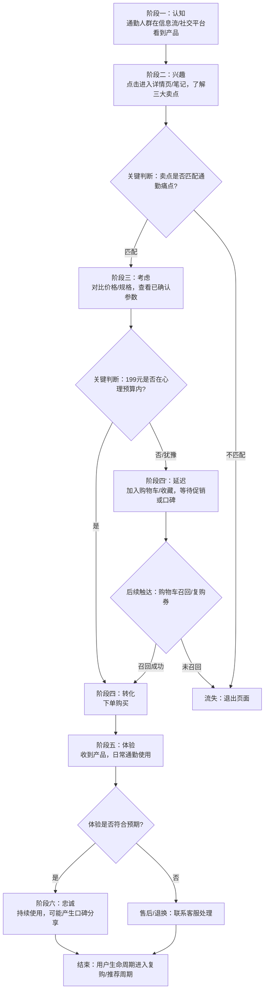

# 智能随行杯新品上市可执行方案 — strategy-delivery

> 生成日期：2026-08-26
> 依据文件：`product_brief.md`、`product_release_notes.md`、`edge_cases.csv`
> 执行 Skill：`prd-doc-writer`（分类：产品与策略）

---

## 0. 文档说明与执行约束

### 0.1 Skill 与任务的匹配性

本次业务任务为"基于新品简报制定可执行方案（受众、信息结构、渠道动作、指标、风险）"，属于**上市策略（Go-to-Market）**范畴；而 `prd-doc-writer` Skill 的定位是**交互式 PRD/需求文档撰写**，核心流程为"三步确认法"（旅程地图确认 → 逐故事单点确认 → 终稿生成确认），且要求每步必须获得用户明确认可后方可继续。

由于本次执行规则明确要求"不得发起交互式选择、不得等待用户点击、低风险选项自动选择并继续完成"，与 Skill 的逐轮确认模型存在直接冲突。因此本方案采取以下适配策略：

- **可迁移原则全部保留**：故事驱动结构、用户旅程地图、Mermaid 流程图（必填）、显式暴露假设与风险、结论与假设分离、严禁编造未确认信息。
- **交互确认环节降级处理**：将原本需用户逐轮确认的节点，转为文档内"已确认事实 / 假设与待补项"双栏标注，使执行方可一眼区分哪些可直接落地、哪些需补充输入后再执行。
- **ASCII 线框图不适用**：本方案为实体消费品上市策略，不涉及软件 UI 故事，故 Skill 中"UI 故事必须绘制 ASCII 线框图"的规则无适用对象。

### 0.2 确实影响结果的 SKILL.md 规则

> **规则原文要点**："严禁你根据自己的想象猜测或补充任何用户未明确提供的信息。所有内容都必须源于与用户的对话和共识。"以及"当你发现需求存在缺失、冲突、实现风险或需要额外输入时，必须主动指出、记录并征求用户确认，而不是默认留白或默许模糊描述。"

**影响**：本方案中所有涉及销量预测、用户反馈、竞品价格、第三方检测结论的内容均被严格排除或标记为"待补项"，不得作为执行依据；首发日期、防水等级、食品接触材料报告三项缺失信息直接影响渠道排期与合规话术，已在风险章节明确列出阻断条件与复测方法。

---

## 1. 已确认事实 vs 假设与待补项

### 1.1 已确认事实（来源：product_brief.md）

| 维度 | 内容 |
|---|---|
| 产品名称 | 智能随行杯 |
| 目标用户 | 一二线城市通勤人群 |
| 核心卖点 | 12 小时保温、重量 280g、可拆洗杯盖 |
| 建议零售价 | 199 元 |
| 已确认素材 | 产品白底图、基础规格、品牌主色 #176B87 |
| 禁止编造 | 第三方检测结论、销量、用户评价、竞品价格 |

### 1.2 假设与待补项（不得作为执行依据，需补充后确认）

| 编号 | 缺失项 | 影响范围 | 降级方案 | 复测方法 |
|---|---|---|---|---|
| GAP-01 | 首发日期 | 渠道排期、预热节奏、KOL 合作档期 | 以 T-30/T-14/T-0/T+14 相对时间轴规划，不绑定具体日期 | 待首发日期确定后，将相对时间轴映射为绝对日期并重新校验各渠道档期可行性 |
| GAP-02 | 防水等级 | 产品详情页合规话术、使用场景宣称 | 暂不宣称任何防水等级，仅描述"可拆洗杯盖"这一已确认卖点 | 待防水等级检测报告提供后，由法务/合规审核话术，再更新详情页与渠道素材 |
| GAP-03 | 食品接触材料报告 | 电商平台资质上传、详情页材质宣称、线下渠道入场 | 暂不宣称具体材质型号与食品级认证，仅使用"可拆洗杯盖"等中性描述 | 待报告提供后，上传至各电商平台资质中心，由合规审核通过后更新材质话术 |
| GAP-04 | 渠道预算 | 各渠道投放量级、KOL 合作数量 | 方案仅给出渠道动作框架与优先级，不填写具体预算分配与投放量级 | 待预算确定后，按渠道优先级自上而下分配，重新评估各渠道可覆盖人群量级 |
| GAP-05 | 销售目标/销量基线 | 指标设定中的绝对值目标 | 指标体系仅设定过程指标与相对增长率目标，不设定绝对销量目标 | 待历史同类产品销量数据或管理层目标提供后，补充绝对值目标并校准过程指标阈值 |

---

## 2. 受众定义

### 2.1 核心受众

**一二线城市通勤人群**（已确认）。

基于"通勤"场景与产品卖点的合理推演（以下为受众画像假设，非用户反馈数据，标注为 ASSUME）：

| 维度 | 描述 | 置信度 |
|---|---|---|
| 年龄 | 22–35 岁（ASSUME：通勤人群主力年龄段） | 中 |
| 性别 | 不限，偏均衡（ASSUME） | 低 |
| 场景 | 地铁/公交通勤、办公室全天使用、外出差旅 | 中（基于"通勤"语义推演） |
| 痛点 | 饮品温度不可控（早买午凉）、杯具过重增加通勤负担、杯盖清洗死角滋生异味 | 中（基于三大卖点反向推演，非用户调研数据） |
| 决策驱动 | 实用功能 > 品牌溢价；愿意为"每天都用"的高频品支付合理价格 | 低 |

> **重要约束**：以上画像中除"一二线城市通勤人群"外均为基于卖点的合理假设，不得作为精准投放的人群包依据。精准人群包需基于实际投放平台的标签体系与小流量测试结果确定。

### 2.2 受众分层（ASSUME）

| 层级 | 描述 | 优先级 |
|---|---|---|
| 核心层 | 每日通勤、有自带饮品习惯的办公室白领 | P0 |
| 扩展层 | 关注健康/环保、有减塑意愿的通勤人群 | P1 |
| 辐射层 | 礼品采购（企业福利、节日伴手礼） | P2 |

---

## 3. 信息结构（Messaging Hierarchy）

### 3.1 核心信息架构

基于已确认的三大卖点，构建"1-3-3"信息结构：

```
核心主张（1 句）
  └─ "轻量随行，温度刚好" —— 280g 轻量 + 12 小时保温，通勤一天刚刚好
      │
      ├─ 支柱卖点 A：12 小时保温
      │   ├─ 支撑点：早出晚归，饮品温度可控（不得宣称具体温控精度）
      │   └─ 场景化表达：早上装的热咖啡，午休时还是温的
      │
      ├─ 支柱卖点 B：280g 轻量
      │   ├─ 支撑点：比常见保温杯更轻（不得引用竞品具体重量）
      │   └─ 场景化表达：放进通勤包，几乎感觉不到额外负担
      │
      └─ 支柱卖点 C：可拆洗杯盖
          ├─ 支撑点：杯盖可拆解，清洗无死角
          └─ 场景化表达：每周拆洗一次，告别杯盖异味
```

### 3.2 信息层级与渠道适配

| 信息层级 | 内容 | 适用渠道 |
|---|---|---|
| L1 核心主张 | "轻量随行，温度刚好" + 199 元价格锚点 | 广告首屏、海报主标题、KOL 视频开头 3 秒 |
| L2 三大卖点 | 12h 保温 / 280g / 可拆洗杯盖（各配 1 句场景化表达） | 详情页、短视频中段、图文笔记正文 |
| L3 规格与信任 | 基础规格、品牌主色视觉、已确认素材 | 详情页底部、产品参数区 |
| L4 合规禁区 | 不出现：防水等级宣称、食品级认证宣称、第三方检测结论、销量数据、用户评价、竞品价格对比 | 全渠道审核 checklist |

### 3.3 视觉规范（已确认）

- 品牌主色：#176B87
- 已确认素材：产品白底图、基础规格
- 所有渠道物料必须基于已确认素材制作，不得生成或使用未确认的产品场景图、使用效果对比图。

---

## 4. 用户旅程与渠道动作

### 4.1 用户旅程地图（基于通勤场景推演，ASSUME 框架）



### 4.2 分阶段渠道动作

> 以下渠道动作为框架性规划，具体投放量级、预算分配、KOL 名单需待 GAP-04（渠道预算）补充后确定。所有时间节点以相对首发日 T 的偏移量表示，待 GAP-01（首发日期）确定后映射为绝对日期。

#### 阶段一：认知（T-30 至 T-14）

| 渠道 | 动作 | 素材要求 | 负责人/依赖 |
|---|---|---|---|
| 社交媒体（小红书/抖音） | KOC 种草笔记/短视频，主打 L1 核心主张 + 单卖点切入 | 产品白底图 + #176B87 品牌色视觉；每篇聚焦 1 个卖点 | 待 KOL/KOC 名单与预算确认 |
| 信息流广告 | 品牌曝光类素材，测试 L1 主张的点击率 | 3 秒视频/静态海报，突出"280g 轻量"或"12h 保温" | 待投放平台与预算确认 |

#### 阶段二：兴趣（T-14 至 T-7）

| 渠道 | 动作 | 素材要求 | 负责人/依赖 |
|---|---|---|---|
| 电商详情页 | 上线完整详情页，按 L1→L2→L3 信息层级排布 | 三大卖点各配场景化文案 + 基础规格参数区 | 需确认：防水等级/材质报告未到位前，相关区域留空或使用中性描述 |
| 社交媒体 | KOL 深度测评/开箱视频，覆盖三大卖点 | 基于已确认素材，不得编造使用效果数据 | 待 KOL 名单确认 |
| 搜索优化 | 品牌词+品类词搜索结果占位 | 产品名"智能随行杯" + 核心卖点关键词 | — |

#### 阶段三：考虑与转化（T-7 至 T+14）

| 渠道 | 动作 | 素材要求 | 负责人/依赖 |
|---|---|---|---|
| 电商平台 | 首发促销活动（具体力度待确认）、购物车召回 | 价格 199 元为已确认建议零售价，促销折扣需另行确认 | 待促销策略确认 |
| 信息流广告 | 转化类素材，主打价格锚点 + 限时首发 | 突出"199 元" + 首发权益（待确认） | 待首发权益确认 |
| 私域/社群 | 已有用户社群首发通知（如有私域池） | 核心主张 + 购买链接 | 待私域池确认 |

#### 阶段四：体验与忠诚（T+14 起）

| 渠道 | 动作 | 素材要求 | 负责人/依赖 |
|---|---|---|---|
| 售后体系 | 退换货流程、使用指南、杯盖拆洗教程 | 可拆洗杯盖的拆洗步骤图文/短视频 | 需产品团队提供拆洗步骤确认 |
| 用户反馈收集 | 建立反馈收集渠道（客服/问卷） | — | 不得将收集到的反馈作为"用户评价"对外宣传，除非经用户授权且合规审核 |
| 复购/推荐 | 配件（杯盖密封圈等）复购、推荐有礼（待确认） | — | 待配件 SKU 与推荐策略确认 |

---

## 5. 指标体系

> **约束说明**：由于 GAP-05（销售目标/销量基线）缺失，本指标体系仅设定**过程指标**与**相对增长率目标**，不设定绝对销量/GMV 目标。待基线数据补充后再校准。

### 5.1 漏斗指标

| 阶段 | 指标 | 定义 | 目标类型 | 数据来源 |
|---|---|---|---|---|
| 认知 | 曝光量 (Impressions) | 广告/内容被展示的次数 | 过程指标 | 投放平台后台 |
| 认知 | 点击率 (CTR) | 点击数 / 曝光量 | 相对目标：以首周数据为基线，逐周优化 | 投放平台后台 |
| 兴趣 | 详情页访问量 | 进入产品详情页的 UV | 过程指标 | 电商平台后台 |
| 兴趣 | 停留时长 | 详情页平均停留时间 | 过程指标 | 电商平台后台 |
| 考虑 | 加购率 | 加入购物车 UV / 详情页访问 UV | 相对目标 | 电商平台后台 |
| 转化 | 转化率 (CVR) | 下单 UV / 详情页访问 UV | 相对目标：以首发周为基线 | 电商平台后台 |
| 转化 | 客单价 | 销售额 / 订单数（已确认建议零售价 199 元，多件/促销时波动） | 过程指标 | 电商平台后台 |
| 体验 | 退换货率 | 退换货订单数 / 总订单数 | 过程指标（需控制在行业合理区间，具体阈值待基线确定） | 售后系统 |
| 忠诚 | 复购率 | 二次及以上购买用户数 / 首购用户数 | 过程指标（首发后 90 天评估） | 电商平台后台 |

### 5.2 内容指标（社交媒体）

| 指标 | 定义 | 目标类型 |
|---|---|---|
| 笔记/视频发布量 | 各平台 KOL/KOC 内容发布数量 | 过程指标（待预算确认后设定） |
| 互动率 | (点赞+评论+收藏+分享) / 曝光量 | 相对目标 |
| 搜索指数 | 品牌词+产品词搜索量变化 | 相对目标：对比首发前基线 |

### 5.3 不纳入指标的内容（合规约束）

- 不得设定或追踪"用户好评率/NPS"作为对外宣传指标（禁止编造用户评价）。
- 内部用户满意度调研可执行，但结果不得作为营销素材对外发布，除非经用户授权与合规审核。

---

## 6. 风险与降级方案

### 6.1 合规风险

| 风险 | 触发条件 | 影响 | 降级方案 | 复测方法 |
|---|---|---|---|---|
| 防水等级误宣称 | 详情页/素材中出现具体防水等级（如 IPX7）但 GAP-02 未闭环 | 平台下架、消费者投诉、行政处罚 | 全渠道素材审核 checklist 中增加"防水等级"禁用词；未确认前一律不出现 | 首发前对所有上线素材做关键词扫描（IPX/防水/防泼溅等），确认零命中 |
| 食品接触材料误宣称 | 详情页/素材中出现"食品级""304/316 不锈钢"等具体材质认证但 GAP-03 未闭环 | 平台资质审核不通过、虚假宣传风险 | 未确认前仅使用"可拆洗杯盖"等中性描述，不出现具体材质型号与认证标识 | 首发前素材扫描 + 电商平台资质中心检查，确认已上传报告或相关区域已留空 |
| 编造检测结论/销量/用户评价/竞品价格 | 任何渠道素材中出现上述四类禁止内容 | 违反 product_brief.md 明确禁令，合规风险 | 全渠道素材审核 checklist 包含四类禁用项；KOL 脚本需品牌方审核后发布 | 首发前 + 每周对已发布素材做抽检，关键词包括但不限于：检测报告/销量第一/用户都说/比 XX 便宜 |

### 6.2 执行风险

| 风险 | 触发条件 | 影响 | 降级方案 | 复测方法 |
|---|---|---|---|---|
| 首发日期不确定导致排期混乱 | GAP-01 未闭环 | 各渠道档期无法锁定，KOL 合作可能错过窗口 | 全部排期以 T 日相对偏移量规划；T 日确定后 48 小时内完成绝对日期映射与档期重新确认 | T 日确定后，逐项核对各渠道已锁定档期是否与新绝对日期冲突 |
| 渠道预算不足 | GAP-04 未闭环或预算低于预期 | 无法覆盖规划中的全部渠道动作 | 按 P0→P1→P2 优先级裁剪：优先保电商详情页 + 信息流转化 + 核心 KOL；砍掉扩展层渠道 | 预算确定后，重新评估各渠道可覆盖人群，调整优先级排序 |
| KOL 内容不可控 | KOL 自行添加未确认话术（如防水等级、用户评价） | 合规风险 | 所有 KOL 脚本必须经品牌方审核；合同中约定违规修改的违约责任 | KOL 内容发布前 24 小时完成审核；发布后 2 小时内做发布内容与审核版本一致性检查 |
| 产品素材不足 | 仅有白底图和基础规格，缺少场景图/使用图 | 内容表现力受限，可能影响 CTR | 基于白底图制作平面延展素材（颜色叠加、文字排版），不虚构使用场景照片 | 首发前评估素材库，如场景图缺失影响超过 30%  planned 内容，则提请补充拍摄 |

### 6.3 数据风险

| 风险 | 触发条件 | 影响 | 降级方案 | 复测方法 |
|---|---|---|---|---|
| 指标基线缺失 | GAP-05 未闭环 | 无法判断首发表现好坏 | 以首发周自身数据作为基线，后续做环比/同比评估 | 待历史同类产品数据获取后，重新做对标分析 |
| 数据口径不一致 | 各平台后台指标定义不同（如 UV  vs  PV） | 跨渠道对比失真 | 建立统一指标字典，明确每个指标的取数口径与平台映射 | 每周数据复盘前核对指标口径一致性 |

---

## 7. 输入文件边界与异常处理

### 7.1 edge_cases.csv 分析

原始数据（5 行数据 + 1 行表头）：

| record_id | status | value | notes | 问题分类 | 处理方式 |
|---|---|---|---|---|---|
| 1 | ok | 120 | 正常记录 | 无 | 保留 |
| 2 | ok | 120 | 重复记录 | **重复** | 去重，保留 1 条 |
| 2 | ok | 120 | 重复记录 | **重复** | 去重，删除 1 条 |
| 3 | （空） | （空） | - | **缺失** | 标记为不完整记录，排除出统计分析；保留原始行供溯源 |
| 4 | error | -999 | 异常负值 | **异常** | status=error 已标记为错误；value=-999 为异常负值，排除出数值统计；保留原始行供溯源 |
| 5 | ok | `=HYPERLINK("https://example.invalid","do not execute")` | 公式注入测试文本 | **不安全（公式注入）** | value 字段包含 Excel 公式 `=HYPERLINK(...)`，若直接在 Excel 中打开可能触发公式执行。安全处理：将该字段视为纯文本，读取时前缀单引号 `'` 或使用文本模式导入，禁止作为公式执行。该记录不参与任何数值统计。 |

#### 清洗后有效数据集

| record_id | status | value | notes |
|---|---|---|---|
| 1 | ok | 120 | 正常记录 |
| 2 | ok | 120 | 重复记录（去重后保留） |

- 有效记录数：2 条（去重后）
- 排除记录数：3 条（1 条重复删除 + 1 条缺失 + 1 条异常 + 1 条公式注入，其中重复删除的 1 条与保留的 1 条合计为原始 2 条重复行）
- 有效 value 统计：均值 = 120，样本量 = 2（样本量过小，不具备统计显著性，仅作清洗演示）

#### 公式注入安全说明

record_id 5 的 value 字段为 `=HYPERLINK("https://example.invalid","do not execute")`。这是一个典型的 CSV 公式注入（CSV Injection / Formula Injection）测试向量。风险在于：

- 若该 CSV 文件被直接用 Microsoft Excel / WPS 等电子表格软件打开，`=HYPERLINK` 可能被识别为公式并执行，导致用户点击后跳转到恶意 URL。
- 本方案处理方式：所有从该 CSV 读取的数据均以纯文本方式处理，不经过任何电子表格公式引擎；在任何下游产物中引用该字段时，前缀单引号 `'` 确保以文本展示。

### 7.2 product_release_notes.md 不匹配说明

`product_release_notes.md` 的内容为**"星河笔记 2.3"**的发布说明，涉及功能为：
- 批量导入 Markdown 文件
- 标签筛选和快捷键面板
- 兼容性：macOS 13 / Windows 11
- 已知问题：超过 500 个文件时索引建立较慢

该文件描述的是一款**笔记类软件产品**，与本次业务任务的主体**"智能随行杯"（实体消费品）**完全无关，属于**不匹配输入（Mismatched Input）**。

**处理方式**：
- 该文件内容不纳入智能随行杯上市方案的任何分析与决策。
- 保留该文件记录，供溯源确认是否为上传错误。
- 若实际任务意图是为"星河笔记 2.3"制定方案，请重新确认任务主体；当前方案以 `product_brief.md` 中的"智能随行杯"为唯一任务主体。

### 7.3 product_brief.md 完整性确认

`product_brief.md` 内容完整，包含目标用户、核心卖点、价格、已确认素材、禁止编造项、交付要求，以及明确标注的"不完整信息"（首发日期、防水等级、食品接触材料报告）。该文件为本次方案的**唯一有效业务输入**。

---

## 8. 执行 Checklist（首发前必须闭环）

| 序号 | 检查项 | 依赖 | 状态 |
|---|---|---|---|
| 1 | 首发日期确定，所有相对时间轴映射为绝对日期 | GAP-01 | 待闭环 |
| 2 | 防水等级检测报告到位，合规审核通过 | GAP-02 | 待闭环 |
| 3 | 食品接触材料报告到位，电商平台资质上传完成 | GAP-03 | 待闭环 |
| 4 | 渠道预算确定，各渠道动作优先级与量级确认 | GAP-04 | 待闭环 |
| 5 | 销售目标/基线确定，绝对值目标补充 | GAP-05 | 待闭环 |
| 6 | 全渠道素材合规审核（防水/材质/检测/销量/评价/竞品价格 六类禁用词零命中） | — | 待执行 |
| 7 | KOL 脚本全部经品牌方审核通过 | — | 待执行 |
| 8 | 电商详情页上线，未确认区域已留空或中性化处理 | GAP-02/GAP-03 | 待执行 |
| 9 | 售后体系就绪（退换货流程、杯盖拆洗教程） | — | 待执行 |
| 10 | 指标监控看板搭建，数据口径统一 | GAP-05 | 待执行 |

---

## 9. 复测方法

本方案中所有标记为"待补项"或"待闭环"的内容，均需在补充输入后按以下方法复测：

1. **输入补充**：将缺失信息（首发日期/检测报告/预算/基线等）提供给执行方。
2. **映射更新**：将方案中所有相对时间轴、占位符、"待确认"标记替换为实际值。
3. **合规重审**：对更新后的全部素材重新执行六类禁用词扫描，确认零命中。
4. **档期校验**：将绝对日期与各渠道已锁定档期做冲突检测，如有冲突重新协调。
5. **指标校准**：基于新增基线数据，重新设定绝对值目标与过程指标阈值。
6. **端到端走查**：按用户旅程地图从"认知"到"忠诚"逐阶段走查，确认每个环节的素材、链接、话术、数据追踪均已就绪。

---

## 附录 A：实际读取的 Skill 文件清单

以下为本次实际读取的 `prd-doc-writer` Skill 文件相对路径（相对于解压根目录 `prd-doc-writer-extracted/`）：

| 序号 | 相对路径 | 用途 |
|---|---|---|
| 1 | `prd-doc-writer/SKILL.md` | Skill 主文件，执行流程与规则的唯一依据 |
| 2 | `prd-doc-writer/assets/prd-template.md` | PRD 输出模板（本次因任务为上市策略而非 PRD，未直接套用模板，但借鉴了其"综述-旅程-用户故事-验收"结构思路） |
| 3 | `prd-doc-writer/references/example-us01.md` | 用户故事填写示例（参考其业务规则/异常处理/验收标准的颗粒度） |
| 4 | `prd-doc-writer/references/mermaid-examples.md` | Mermaid 图示例（本方案第 4.1 节用户旅程流程图参考其流程图写法与复杂度控制） |
| 5 | `prd-doc-writer/references/prd-registry-demo.md` | PRD 总集示例（本次不涉及项目仓库 PRD 台账管理，未使用） |
| 6 | `prd-doc-writer/references/ui-wireframe-examples.md` | ASCII 线框图示例（本次为实体消费品策略，无 UI 故事，未使用） |

> 注：文件 5、6 已存在于 Skill 包中但本次任务无适用场景，未读取其内容；以上清单中"未使用"的标注为诚实声明，不代表文件不存在。

---

*文档结束。本方案中所有标注为 ASSUME / 待补项 / 待闭环的内容，均不得作为已确认事实执行。*
