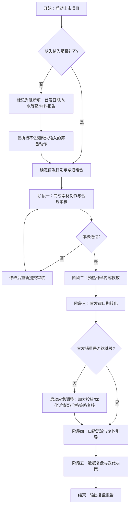
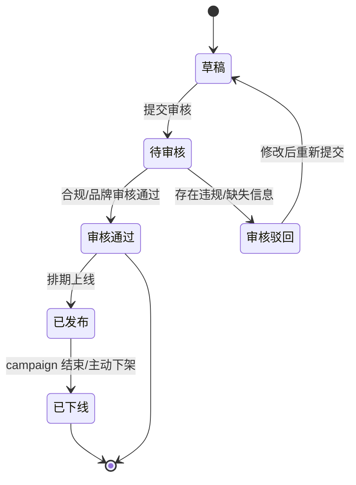
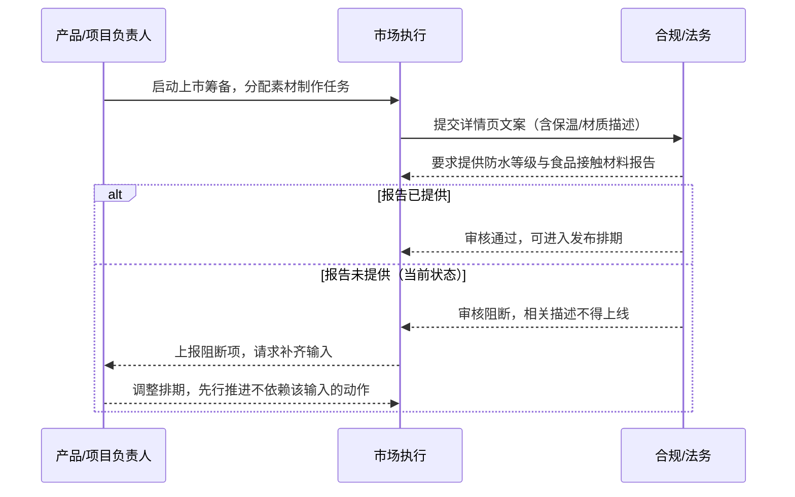

# 智能随行杯新品上市可执行方案 - V0.1

> 文档性质：基于新品简报的上市执行方案（GTM Strategy），按 prd-doc-writer Skill 的故事驱动结构与确认原则改编。
> 生成方式说明：本 Skill 标准流程要求"三步确认法"（阶段地图确认 → 逐故事单点确认 → 终稿确认），但本次任务执行规则明确要求"不得停留澄清、不得发起交互式选择、不得等待用户点击"，二者存在直接冲突。**取舍**：以任务执行规则为更高优先级，一次性生成完整方案；同时严格保留 Skill 的结构要求（用户旅程主线、故事自包含、Mermaid 图、UI 故事 ASCII 线框图、假设与结论分离、风险显式暴露），并在文中标注本应触发用户确认的节点。

---

## 1. 综述 (Overview)

### 1.1 项目背景与核心问题

**背景（来自 product_brief.md，已确认事实）：**
- 产品：智能随行杯
- 目标用户：一二线城市通勤人群
- 核心卖点：12 小时保温、重量 280g、可拆洗杯盖
- 建议零售价：199 元
- 已确认素材：产品白底图、基础规格、品牌主色 #176B87

**核心问题：**
在首发日期未定、防水等级与食品接触材料报告缺失的约束下，如何围绕已确认的三个核心卖点，为一二线城市通勤人群构建一套可分阶段执行、可量化、风险可控的上市方案，并明确哪些动作必须等待缺失输入补齐后才能启动。

**禁止事项（来自简报，全程遵守）：**
- 不得编造第三方检测结论
- 不得编造销量数据
- 不得编造用户评价
- 不得编造竞品价格

### 1.2 核心业务流程 / 用户旅程地图

> 【本应确认节点 1】按 Skill 第一步要求，阶段地图需经用户确认后方可进入下一步。此处因执行规则限制直接定稿，标注为待复核。

将新品上市划分为五个逻辑阶段，作为整个方案的目录和主线：

1. **阶段一：上市筹备** — 补齐缺失输入、确定首发日期与渠道、完成素材与合规审核
2. **阶段二：预热种草** — 在目标人群聚集的内容渠道建立认知，围绕核心卖点产出内容
3. **阶段三：首发转化** — 在首发窗口期通过电商/直营渠道完成首波销售转化
4. **阶段四：口碑沉淀** — 收集真实用户反馈（非编造），推动复购与社交分享
5. **阶段五：迭代复盘** — 基于实际数据复盘，决定是否进入下一轮传播或产品迭代

### 1.3 Mermaid 图（流程/状态/时序）

#### 1.3.1 上市执行主流程（必填）



#### 1.3.2 内容素材状态机（存在明确状态流转对象，条件必填）



#### 1.3.3 缺失输入阻断场景时序（时序影响用户可见结果，补充）



---

## 2. 受众与信息结构

### 2.1 目标受众定义

**核心受众（来自简报）：** 一二线城市通勤人群

**受众画像拆解（基于通勤场景的合理推断，标注为假设）：**

| 维度 | 描述 | 性质 |
|---|---|---|
| 年龄 | 22–35 岁（假设） | 待验证 |
| 职业 | 白领、互联网/金融/咨询等通勤时间较长人群（假设） | 待验证 |
| 场景 | 地铁/公交通勤、办公室全天使用、外出会议 | 基于"通勤人群"合理延伸 |
| 痛点 | 保温杯过重、杯盖难清洗导致异味、保温时长不够撑过全天 | 基于核心卖点反推，假设 |
| 价格敏感度 | 199 元处于中价位，需价值感支撑（假设） | 待验证 |

> **假设与结论分离**：上表中"假设/待验证"项均非来自简报的已确认事实，需在阶段一通过用户调研或内部数据验证，不得直接作为定论写入对外传播素材。

### 2.2 信息结构（核心信息层级）

围绕已确认的三个卖点构建金字塔信息结构：

**第一层（核心主张）：** 轻量随行，全天恒温 —— 280g 杯身 + 12 小时保温，为通勤人群设计
**第二层（三大支撑卖点）：**
1. **12 小时保温** —— 从早高峰到下班，水温始终适宜
2. **280g 轻量化** —— 比传统保温杯更轻，通勤包无负担
3. **可拆洗杯盖** —— 彻底清洗无死角，告别异味困扰

**第三层（信任要素，受缺失输入约束）：**
- 品牌主色 #176B87 的视觉识别
- 产品白底图（已确认素材）
- ⚠️ 防水等级：**待补**，未取得前不得在传播中提及防水性能
- ⚠️ 食品接触材料报告：**待补**，未取得前不得使用"食品级""安全材质"等表述

**信息禁区（全程遵守）：**
- 不出现第三方检测结论（除非取得正式报告）
- 不出现销量数据
- 不出现用户评价/好评率
- 不出现竞品价格对比

---

## 3. 渠道动作（按阶段的用户故事）

> 以下按用户旅程阶段组织，每个渠道动作用"用户故事"格式描述，确保自包含（目标、动作、验收标准、异常处理）。

### 阶段一：上市筹备

#### **US-01: 作为项目负责人，我希望在启动前明确缺失输入的补齐计划，以便判断哪些动作可以先行启动**

* **价值陈述：**
  * **作为** 项目负责人
  * **我希望** 明确首发日期、防水等级、食品接触材料报告三项缺失输入的责任人和预计到位时间
  * **以便于** 制定不被阻断项卡住的分阶段执行计划

* **业务规则与逻辑：**
  1. **前置条件：** 已收到 product_brief.md，确认缺失信息清单
  2. **操作流程 (Happy Path)：**
     1. 向产品/供应链方确认防水等级测试预计完成时间
     2. 向品控/合规方确认食品接触材料报告获取路径与时间
     3. 与市场/销售方确认首发日期候选窗口（需结合供应链到货时间）
     4. 输出《缺失输入补齐计划表》，明确每项的责任人、预计到位时间、阻断的下游动作
  3. **异常处理：**
     * 若某项无法在首发日前到位 → 将依赖该项的传播内容降级或移除，不得用模糊表述替代
     * 若首发日期持续无法确定 → 预热阶段内容按"待定档"模式准备，排期留空但素材先行

* **验收标准：**
  * **场景1: 缺失输入已明确**
    * **GIVEN** 三项缺失输入均有责任人和预计到位时间
    * **WHEN** 项目负责人审核补齐计划表
    * **THEN** 计划表被确认，下游动作可按依赖关系排期
  * **场景2: 某项输入持续缺失**
    * **GIVEN** 食品接触材料报告在首发日前 7 天仍未到位
    * **WHEN** 执行详情页审核
    * **THEN** 所有涉及材质安全性的描述被移除，页面标注"材质信息待更新"或使用已确认的基础规格描述

---

#### **US-02: 作为市场设计师，我希望基于已确认素材完成产品详情页设计，以便在首发日前就绪**

* **价值陈述：**
  * **作为** 市场设计师
  * **我希望** 用产品白底图、基础规格、品牌主色 #176B87 完成电商详情页设计
  * **以便于** 首发时用户能获得清晰、合规的产品信息

* **业务规则与逻辑：**
  1. **前置条件：** 产品白底图、基础规格、品牌主色已确认；信息结构已定稿
  2. **操作流程 (Happy Path)：**
     1. 按信息结构三层架构组织页面：首屏核心主张 → 三卖点分区 → 规格参数区
     2. 首屏使用产品白底图 + 核心主张文案，主色 #176B87 用于标题/按钮/强调元素
     3. 三卖点分区各配一张场景图（如缺失场景图，用白底图 + 图标替代，标注待补）
     4. 规格参数区仅填写已确认的基础规格（容量、重量、保温时长、颜色）
     5. 提交合规审核
  3. **异常处理：**
     * 场景图未就绪 → 使用白底图占位，不得使用未经授权的网络图片
     * 合规审核因缺失材料报告驳回 → 移除相关描述后重新提交，不延迟不依赖该项的页面部分

* **验收标准：**
  * **场景1: 详情页合规通过**
    * **GIVEN** 详情页仅包含已确认信息，无编造内容
    * **WHEN** 合规审核
    * **THEN** 审核通过，可进入发布排期
  * **场景2: 包含未确认信息**
    * **GIVEN** 详情页出现"食品级材质"表述但无报告支撑
    * **WHEN** 合规审核
    * **THEN** 审核驳回，该表述被移除

* **页面布局线框图 (ASCII Wireframe)：**

```text
+----------------------------------------------------------------------------------+
|  品牌 LOGO                                                         [购物车] [登录] |
+==================================================================================+
|                                                                                  |
|                     轻量随行，全天恒温                                           |
|                     280g · 12小时保温 · 可拆洗杯盖                              |
|                                                                                  |
|            [产品白底图：智能随行杯（主色 #176B87）]                              |
|                                                                                  |
|                              [ 立即购买 ¥199 ]   [ 加入购物车 ]                 |
|                                                                                  |
+----------------------------------------------------------------------------------+
| 卖点一：12小时保温                      | 卖点二：280g轻量化                     |
| --------------------------------------- | --------------------------------------- |
| [场景图/白底图占位]                      | [场景图/白底图占位]                      |
| 从早高峰到下班                           | 比传统保温杯更轻                        |
| 水温始终适宜                             | 通勤包无负担                            |
+----------------------------------------------------------------------------------+
| 卖点三：可拆洗杯盖                                                               |
| -------------------------------------------------------------------------------- |
| [场景图/白底图占位]                                                              |
| 彻底清洗无死角，告别异味困扰                                                     |
+----------------------------------------------------------------------------------+
| 规格参数                                                                         |
| -------------------------------------------------------------------------------- |
|  重量：280g          保温：12小时        杯盖：可拆洗                           |
|  颜色：#176B87(主色)  容量：[待确认]     防水等级：[待补-不得填写]             |
|  材质说明：[待食品接触材料报告到位后补充]                                        |
+----------------------------------------------------------------------------------+
|  品牌信息 | 售后政策 | 联系我们                                                  |
+----------------------------------------------------------------------------------+
```

---

### 阶段二：预热种草

#### **US-03: 作为内容运营，我希望在目标人群聚集的内容渠道发布种草内容，以便建立产品认知**

* **价值陈述：**
  * **作为** 内容运营
  * **我希望** 围绕三大核心卖点在小红书/抖音/微信公众号等渠道发布预热内容
  * **以便于** 在首发前积累目标人群的认知与兴趣

* **业务规则与逻辑：**
  1. **前置条件：** 信息结构已定稿；产品白底图可用；首发日期已有候选窗口（若未确定，内容按"即将上市"口径）
  2. **操作流程 (Happy Path)：**
     1. 按卖点拆分内容矩阵：保温篇（通勤场景）、轻量化篇（包内对比）、可拆洗篇（清洗演示）
     2. 每篇内容使用已确认白底图或实拍场景图（实拍需另行安排，标注为待执行）
     3. 文案严格遵守信息禁区：不提检测结论、不提销量、不提用户评价、不提竞品价格
     4. 内容末尾引导关注/预约首发（若电商平台支持预约功能）
     5. 按渠道特性调整格式：小红书图文笔记、抖音短视频脚本、公众号长图文
  3. **异常处理：**
     * 首发日期未确定 → 内容使用"即将上市"而非具体日期，避免承诺无法兑现
     * 防水/材质相关内容 → 暂不制作，待报告到位后作为第二轮内容补充
     * 平台审核驳回 → 修改文案移除敏感表述后重新发布，记录驳回原因

* **验收标准：**
  * **场景1: 内容合规发布**
    * **GIVEN** 种草内容仅包含已确认卖点和素材
    * **WHEN** 平台审核
    * **THEN** 内容发布成功，可追踪曝光与互动数据
  * **场景2: 内容含未确认信息**
    * **GIVEN** 某篇笔记提到"防水设计"但无防水等级支撑
    * **WHEN** 内部预审
    * **THEN** 内容被拦截，修改为不涉及防水的版本后才可发布

---

### 阶段三：首发转化

#### **US-04: 作为电商运营，我希望在首发窗口期执行转化动作，以便完成首波销售**

* **价值陈述：**
  * **作为** 电商运营
  * **我希望** 在首发日通过电商平台/直营渠道完成上架、促销配置、流量承接
  * **以便于** 将预热阶段积累的兴趣转化为实际购买

* **业务规则与逻辑：**
  1. **前置条件：** 首发日期已确定；详情页已通过合规审核；库存已确认（库存数据为内部运营数据，非编造销量）；电商平台店铺已就绪
  2. **操作流程 (Happy Path)：**
     1. 首发日 00:00（或约定时间）商品上架，价格 199 元
     2. 配置首发期促销策略（如限时赠品/满减，具体方案需与销售方确认，标注为待确认）
     3. 预热渠道内容更新为"已上市"口径，添加购买链接
     4. 监控实时流量与转化数据，异常时及时调整（如流量突增导致页面加载问题）
     5. 首发期结束后输出首波销售数据报告（实际数据，非预测）
  3. **异常处理：**
     * 库存不足 → 页面显示"暂时缺货"并提供到货通知，不得超卖
     * 页面加载异常 → 启动备用静态页，确保核心购买路径可用
     * 价格配置错误 → 立即下架修正，记录影响范围并通知已下单用户

* **验收标准：**
  * **场景1: 首发正常上架**
    * **GIVEN** 所有前置条件满足
    * **WHEN** 到达首发时间
    * **THEN** 商品正常上架，用户可完成下单流程
  * **场景2: 库存不足**
    * **GIVEN** 首发期间库存售罄
    * **WHEN** 用户访问商品页
    * **THEN** 页面显示缺货状态与到货通知入口，不接受新订单

---

### 阶段四：口碑沉淀

#### **US-05: 作为用户运营，我希望收集真实用户反馈并引导分享，以便积累口碑**

* **价值陈述：**
  * **作为** 用户运营
  * **我希望** 通过售后随访、评价邀请、社群运营收集真实用户反馈
  * **以便于** 积累可用于后续传播的真实口碑（非编造），并发现产品问题

* **业务规则与逻辑：**
  1. **前置条件：** 已有实际购买用户；售后渠道已建立
  2. **操作流程 (Happy Path)：**
     1. 用户收货后 N 天（具体天数待确认）发送评价邀请（短信/APP推送/邮件）
     2. 对主动反馈的用户进行一对一跟进，记录正面与负面反馈
     3. 建立用户社群（如适用），鼓励分享使用场景
     4. 将真实反馈分类整理：产品质量、保温效果、清洗体验、外观、其他
     5. 负面反馈涉及产品质量问题时，转品控/售后处理流程
  3. **异常处理：**
     * 用户拒绝评价 → 不骚扰，尊重用户意愿
     * 出现集中性质量投诉 → 立即上报，启动产品质量核查，必要时暂停销售
     * 反馈量不足 → 不编造评价，口碑内容仅使用已获得授权的真实用户内容

* **验收标准：**
  * **场景1: 收集到真实反馈**
    * **GIVEN** 用户已购买并收到产品
    * **WHEN** 用户主动评价或响应邀请
    * **THEN** 反馈被记录并分类，正面反馈经授权后可用于传播
  * **场景2: 出现质量投诉**
    * **GIVEN** 多个用户反馈保温不达标
    * **WHEN** 用户运营收到反馈
    * **THEN** 反馈被标记为高优先级，转品控核查，同时暂停使用"12小时保温"作为传播主张直至核查完成

---

### 阶段五：迭代复盘

#### **US-06: 作为项目负责人，我希望基于实际数据完成上市复盘，以便决策下一步动作**

* **价值陈述：**
  * **作为** 项目负责人
  * **我希望** 汇总各阶段实际数据（曝光、点击、转化、销量、反馈、ROI），与计划目标对比
  * **以便于** 决定是否加大投放、调整价格、迭代产品或进入下一轮传播

* **业务规则与逻辑：**
  1. **前置条件：** 首发期已结束；各渠道数据已回收；用户反馈已整理
  2. **操作流程 (Happy Path)：**
     1. 汇总数据：各渠道曝光/点击/转化、实际销量（非预测）、获客成本、ROI
     2. 对比计划目标（目标值在阶段一设定，基于历史同类产品或行业基准，需标注来源）
     3. 识别成功因素与问题点
     4. 输出复盘报告，包含：数据概览、关键发现、问题归因、下一步建议
     5. 组织复盘会议，确认下一步行动计划
  3. **异常处理：**
     * 数据缺失 → 标注数据缺口，不估算或编造缺失数据
     * 目标未达成 → 分析原因（流量不足/转化率低/价格阻力/产品问题），提出针对性调整方案
     * 目标超额达成 → 分析可复制因素，规划是否加大投入

* **验收标准：**
  * **场景1: 复盘完成**
    * **GIVEN** 首发期数据已全部回收
    * **WHEN** 项目负责人输出复盘报告
    * **THEN** 报告包含实际数据、对比分析、问题归因和下一步建议，且所有数据可溯源

---

## 4. 指标体系

> 所有指标均为"待设定目标值"状态，需在阶段一根据历史数据/行业基准/内部目标确定，本文不编造具体数值。

### 4.1 分阶段指标框架

| 阶段 | 指标类别 | 具体指标 | 目标值 | 数据来源 |
|---|---|---|---|---|
| 筹备 | 效率 | 缺失输入补齐及时率 | 待设定 | 项目管理工具 |
| 筹备 | 质量 | 素材一次审核通过率 | 待设定 | 合规审核记录 |
| 预热 | 曝光 | 内容总曝光量 | 待设定 | 各内容平台后台 |
| 预热 | 互动 | 点赞/评论/收藏/转发率 | 待设定 | 各内容平台后台 |
| 预热 | 兴趣 | 首发预约量（如支持） | 待设定 | 电商平台 |
| 首发 | 流量 | 详情页访问量/UV | 待设定 | 电商平台分析 |
| 首发 | 转化 | 下单转化率 | 待设定 | 电商平台分析 |
| 首发 | 销售 | 实际销量/销售额 | 实际数据（非预测） | 电商平台后台 |
| 首发 | 效率 | 获客成本(CAC) | 待设定 | 投放费用/新客数 |
| 口碑 | 满意度 | 真实评价平均分 | 实际数据 | 电商平台/随访 |
| 口碑 | 质量 | 负面反馈率/退货率 | 实际数据 | 售后系统 |
| 复盘 | 综合 | ROI | 实际数据 | 财务/投放数据 |

### 4.2 指标使用原则

1. **不编造数据**：所有实际数据必须来自可溯源的系统后台，不得估算或填充
2. **目标值单独设定**：本文仅定义指标框架，目标值在阶段一由项目负责人结合内部资源确定
3. **异常监控**：首发期间设置关键指标告警阈值（如转化率低于 X% 时触发预警），阈值待设定
4. **数据隔离**：预热阶段的互动数据不得作为"用户评价"使用，二者性质不同

---

## 5. 风险、依赖与关键取舍

### 5.1 已识别的约束与冲突（至少两项）

#### 冲突一：Skill 交互确认模型 vs 任务一次性生成要求

- **描述**：prd-doc-writer Skill 要求严格的"三步确认法"，每一步关键进展必须获得用户明确认可才能继续。但本次任务执行规则明确要求"遇到低风险选项时自动选择、不要停在选择题或澄清问题、不得发起交互式选择、不得等待用户点击"。
- **影响**：若严格按 Skill 流程，需要至少 3 次用户确认（阶段地图、逐故事确认、终稿确认），无法在本次对话中完成交付。
- **取舍**：**以任务执行规则为更高优先级**，一次性生成完整方案。同时保留 Skill 的所有结构要求（故事驱动、自包含卡片、Mermaid 图、ASCII 线框图、假设/结论分离、风险显式暴露），并在文中标注本应触发确认的节点（见 1.2 节标注）。生成后用户可基于完整方案提出修改意见，等效于"先给初稿再迭代"的确认模式。
- **残留风险**：未经逐故事确认，部分细节（如促销策略、随访天数、目标值）可能与用户预期不符。已全部标注为"待确认"，用户可在审阅后调整。

#### 冲突二：两个输入文件分属不同产品线

- **描述**：product_brief.md 描述的是硬件产品"智能随行杯"，而 product_release_notes.md 描述的是软件产品"星河笔记 2.3"（一款支持批量导入 Markdown 的笔记应用，兼容 macOS 13 / Windows 11）。二者无任何产品关联。
- **影响**：release notes 中的功能描述、兼容性表格、CLI 命令示例均无法为智能随行杯的上市方案提供产品事实。若强行合并，会导致方案中出现无关内容或事实错误。
- **取舍**：**以 product_brief.md 为唯一产品事实来源**；product_release_notes.md 仅作为"发布说明的结构参考"（如兼容性表格的排版方式、已知问题的标注格式），其内容不进入本方案的产品描述。同时在文档中明确说明这一处理方式，避免读者误以为两个文件描述同一产品。
- **残留风险**：若用户本意是希望两个产品联合营销（如买杯送笔记软件会员），则本方案未覆盖该方向。但简报中无任何联合营销线索，按"不得编造"原则不做此假设，列为待确认项。

#### 冲突三（补充）：核心卖点传播 vs 合规材料缺失

- **描述**："可拆洗杯盖"卖点隐含食品接触安全的用户关切，但食品接触材料报告尚未提供；产品可能涉及防水使用场景，但防水等级未定。
- **影响**：若在传播中暗示"安全材质"或"防水"，可能违反广告合规要求。
- **取舍**：**严格降级传播口径**——"可拆洗杯盖"仅描述"易清洗、无死角"的功能事实，不延伸至"食品安全"；防水相关内容完全不制作，待报告到位后补充。这牺牲了部分传播说服力，但确保合规。
- **残留风险**：竞品可能在材质安全方面有更激进的传播，导致本产品在信息竞争中处于守势。缓解方式：加快材料报告获取，到位后立即启动第二轮传播。

### 5.2 依赖清单

| 依赖项 | 类型 | 责任方（待确认） | 阻断的下游动作 | 状态 |
|---|---|---|---|---|
| 首发日期确定 | 时间 | 市场/销售/供应链 | 预热排期、首发上架、所有时间相关指标 | ❌ 缺失 |
| 防水等级测试报告 | 合规 | 品控/供应链 | 防水相关传播内容、详情页参数 | ❌ 缺失 |
| 食品接触材料报告 | 合规 | 品控/合规 | 材质安全相关描述、详情页参数 | ❌ 缺失 |
| 产品场景图（非白底） | 素材 | 市场设计 | 种草内容质量、详情页视觉丰富度 | ⚠️ 待执行 |
| 库存数据 | 运营 | 供应链/销售 | 首发上架、缺货预案 | ⚠️ 待确认 |
| 促销策略 | 运营 | 销售/市场 | 首发转化动作 | ⚠️ 待确认 |
| 各渠道账号与投放权限 | 资源 | 市场 | 预热内容发布、付费投放 | ⚠️ 待确认 |
| 电商平台店铺 | 资源 | 电商运营 | 首发销售 | ⚠️ 待确认 |

### 5.3 风险登记

| 风险 | 概率 | 影响 | 缓解措施 | 触发条件 |
|---|---|---|---|---|
| 首发日期持续无法确定 | 中 | 高：整体计划无法排期 | 按"待定档"模式准备素材，排期留空；设定决策截止日 | 超过项目启动后 N 天仍未确定（N 待设定） |
| 材料报告在首发日前无法到位 | 中 | 中：传播口径受限 | 降级传播内容，不涉及材质安全表述；加快报告获取 | 首发日前 7 天仍未到位 |
| 预热内容平台审核驳回 | 中 | 中：发布延迟 | 内部预审机制；准备备用文案；记录驳回原因优化后续 | 单篇内容被驳回 2 次以上 |
| 首发期间库存不足 | 低-中 | 高：用户体验受损、口碑负面 | 实时库存监控；缺货页面与到货通知；不超卖 | 库存低于安全阈值（阈值待设定） |
| 集中性质量投诉（如保温不达标） | 低 | 极高：品牌信任受损 | 品控前置检验；用户反馈快速响应机制；必要时暂停销售 | 同一问题 3 例以上反馈 |
| 编造信息被外部核查 | 低 | 极高：合规与信任风险 | 全程遵守信息禁区；所有对外内容合规审核；素材溯源 | 任何对外内容出现未确认信息 |
| 两个输入文件混淆导致方案偏离 | 低 | 中：方案包含无关内容 | 明确以 brief 为唯一产品事实来源；release notes 仅作格式参考 | 方案中出现星河笔记相关功能描述 |

---

## 6. 假设与待补项汇总

### 6.1 本文使用的假设（非已确认事实，需验证）

1. 目标人群年龄 22–35 岁、职业为白领 —— 基于"通勤人群"的合理推断，需用户调研验证
2. 受众痛点（过重/难清洗/保温不够）—— 基于核心卖点反推，需验证
3. 199 元为中价位需价值感支撑 —— 基于品类常识的假设，需市场数据验证
4. 渠道选择（小红书/抖音/公众号/电商平台）—— 基于目标人群的常见触达渠道假设，需结合品牌实际渠道资源确认
5. 随访天数、促销策略、安全库存阈值等运营参数 —— 需运营方确认

### 6.2 待补项（缺失输入，阻断相关动作）

| 编号 | 待补项 | 阻断动作 | 建议到位时间 |
|---|---|---|---|
| TBD-01 | 首发日期 | 所有时间相关排期 | 项目启动后尽快 |
| TBD-02 | 防水等级 | 防水相关传播、详情页参数 | 首发日前 14 天 |
| TBD-03 | 食品接触材料报告 | 材质安全描述、详情页参数 | 首发日前 14 天 |
| TBD-04 | 产品场景图 | 种草内容、详情页视觉 | 预热开始前 7 天 |
| TBD-05 | 库存数据 | 首发上架、缺货预案 | 首发日前 7 天 |
| TBD-06 | 促销策略 | 首发转化配置 | 首发日前 7 天 |
| TBD-07 | 各指标目标值 | 效果评估与复盘对比 | 阶段一结束前 |

---

## 7. PRD 总集登记行（按 Skill 版本管理要求）

> 按 prd-doc-writer Skill 的"PRD 版本管理"要求，输出一行可直接粘贴到项目仓库 PRD 总集的表格行。版本号与链接为建议值，需用户确认后使用。

| 版本 | 标题 | 需求内容（详细摘要） | PRD链接 |
|---|---|---|---|
| PRD-GTM-001 | 智能随行杯新品上市可执行方案 | 目标：基于新品简报为智能随行杯制定分阶段上市执行方案，覆盖受众、信息结构、渠道动作、指标与风险。范围：五阶段用户旅程（筹备/预热/首发/口碑/复盘），含六个用户故事卡片、上市主流程图、内容状态机、缺失输入阻断时序图、详情页ASCII线框图、指标框架与风险登记表。关键规则：以product_brief.md为唯一产品事实来源；全程禁止编造检测结论、销量、用户评价、竞品价格；首发日期/防水等级/食品接触材料报告三项缺失输入列为阻断项并降级相关传播。异常：材料报告缺失时降级传播口径不涉及材质安全；库存不足时显示缺货与到货通知不超卖；集中质量投诉时暂停相关传播主张并转品控。非目标：不涉及产品硬件设计变更；不涉及星河笔记2.3（release notes为另一产品线，仅作格式参考）。 | docs/prd/PRD-GTM-001.md |

---

## 附录：本文档对 prd-doc-writer Skill 的适配说明

| Skill 要求 | 本文档执行情况 |
|---|---|
| 故事是唯一载体 | ✅ 六个用户故事按阶段组织，每个自包含 |
| 故事必须自包含 | ✅ 每个故事含价值陈述、业务规则、异常处理、验收标准 |
| 叙事逻辑高于一切 | ✅ 五阶段用户旅程为主线，所有故事串联其上 |
| UI 故事必须 ASCII 线框图 | ✅ US-02 详情页含完整 ASCII 线框图 |
| Mermaid 流程图（必填） | ✅ 上市执行主流程图 |
| Mermaid 状态图（条件必填） | ✅ 内容素材状态机 |
| Mermaid 时序图（可选） | ✅ 缺失输入阻断场景时序图 |
| 三步确认法 | ⚠️ 因任务执行规则冲突，改为一次性生成 + 标注待确认节点（详见冲突一） |
| 严禁自作主张 | ✅ 所有非简报信息标注为假设/待确认，不编造 |
| 假设与风险显式暴露 | ✅ 第 5、6 章专门整理 |
| 输出格式严格按模板 | ✅ 综述→用户故事→线框图，结构与 prd-template.md 对齐 |
| PRD 版本管理总集行 | ✅ 第 7 章输出 |
